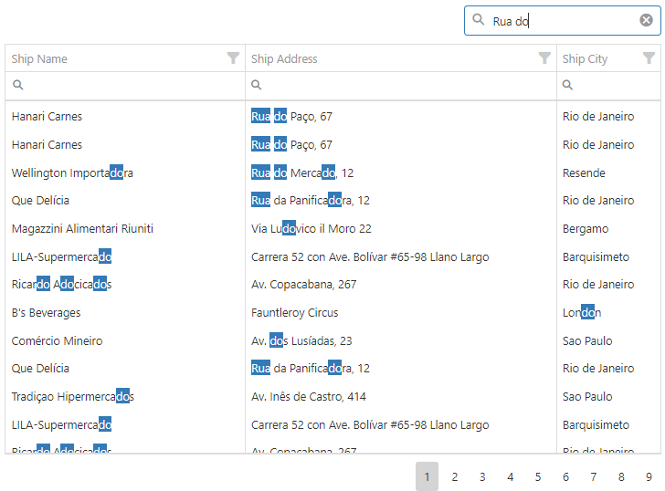

<!-- default badges list -->

<!-- default badges end -->

# DataGrid for DevExtreme - Multiple words search

This example illustrates how to implement multiple words search in DataGrid

## Files to Review

- **jQuery**
    - [index.html](jQuery/index.html)
    - [index.js](jQuery/index.js)
- **Angular**
    - [app.component.html](angular/src/app/app.component.html)
    - [app.component.ts](angular/src/app/app.component.ts)
- **Vue**
    - [App.vue](vue/src/App.vue)
- **React**
    - [App.js](react/src/App.js)
- **ASP.Net Core**    
    - [Index.cshtml](ASP.NET%20Core/ASP.NET%20Core/Views/Home/Index.cshtml)

## Documentation

- [Getting Started with DataGrid](https://js.devexpress.com/Documentation/Guide/UI_Components/DataGrid/Getting_Started_with_DataGrid/)
- [DataGrid - API Reference](https://js.devexpress.com/Documentation/ApiReference/UI_Components/dxDataGrid/)
